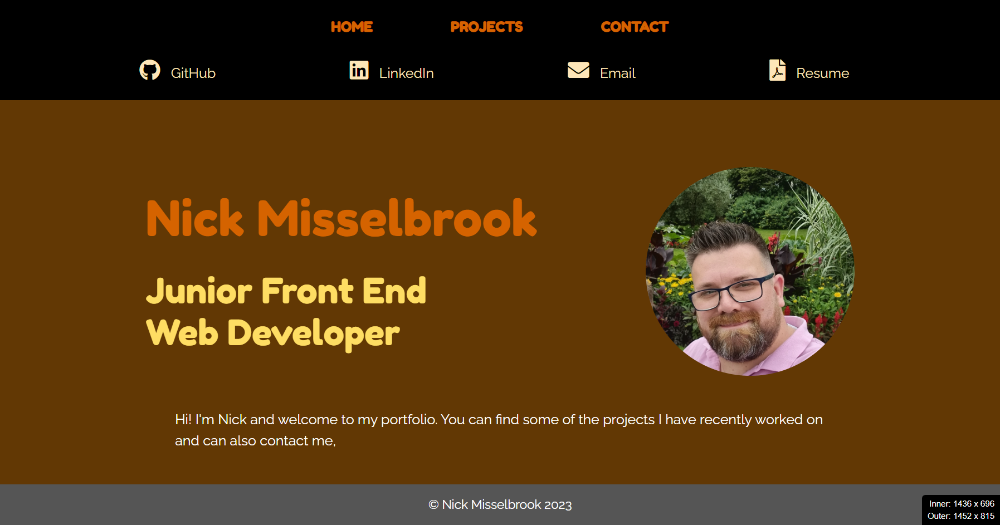

  # Portfolio

  ## Description

  This is my personal portfolio that showcases the projects I have done on the bootcamp and will be looked at by potential employers.  All my contact information is on there for employers to contact me.

  This project was built using React, combined with HTML, CSS and JavaScript.  This was my first time building a project using React.  I faced a fair few problems along the way but after a lot of Googling I always found a solution.

  The biggest problem I faced, trying to pass props from one class to another class via React Router.  When a user clicks on a project in the Project Gallery, I wanted a new component to populate the page with the props it had been passed.  But I found that it was hard to pass props to a class, particularly if it’s via React Router.  I had to change the component that was receiving the props to a function rather than it being a class.  This allowed the component to receive the information via the useLocation() hook.
  
  Another Issue I had, which took a long time to find the answer, getting images to display when the path for the image was being extracted from a JSON file.  I eventually found out it was mostly to do with where the images were stored, they needed to be stored with the index.html file in the public folder.

  I have learnt a lot about React during this project, but have also learnt I still have so much to learn about it.  

  In the future I would like to add some features to make my portfolio a bit more interesting, such as some animations and maybe a few images.

  ## Table of Contents

  - [Installation](#installation)
  - [Usage](#usage)
  - [Credits](#credits)
  - [License](#license)
  - [Tests](#tests)
  - [Questions](#questions)

  ## Installation

  The deployed Portfolio can be found at [Portfolio](https://nickmbk.github.io/nickmbk-portfolio)

  Repo: [Portfolio](https://www.github.com/nickmbk/nickmbk-portfolio)

  ## Usage

  Once the page has loaded, you will be presented with the Home page, which displays a little information and a photo.
  
  Click on Projects to show a gallery of the recent projects that I have worked on.  By clicking any of the projects you are taken to that projects page.
  
  The project will show the name, a screenshot of the app, a brief description, links to the deployed site and the GitHub repo and what technologies were used for that project.
  
  Click on the Contact page to find the links of how to contact me and also a contact form that you can fill out to also contact me.

  

  ## Credits

  ### Resources
  
  [React Documentation](https://reactjs.org/docs/getting-started.html)

  [React Router Documentation](https://reactrouter.com/en/main)

  [Bootstrap Documentation](https://getbootstrap.com/docs/5.3/getting-started/introduction/)

  [Passing props through React Router Link](https://ui.dev/react-router-pass-props-to-link)

  [Using images from a JSON file](https://www.youtube.com/watch?v=NWG1Ygt1k1k&t=381s)

  ## License
  
  No license was used for this project, as it is not open source.

  ## Questions

  Please contact me if you have any questions:

  Nick Misselbrook

  [nick.mbk@hotmail.com](nick.mbk@hotmail.com)

  [GitHub: nickmbk](https://www.github.com/nickmbk)

  